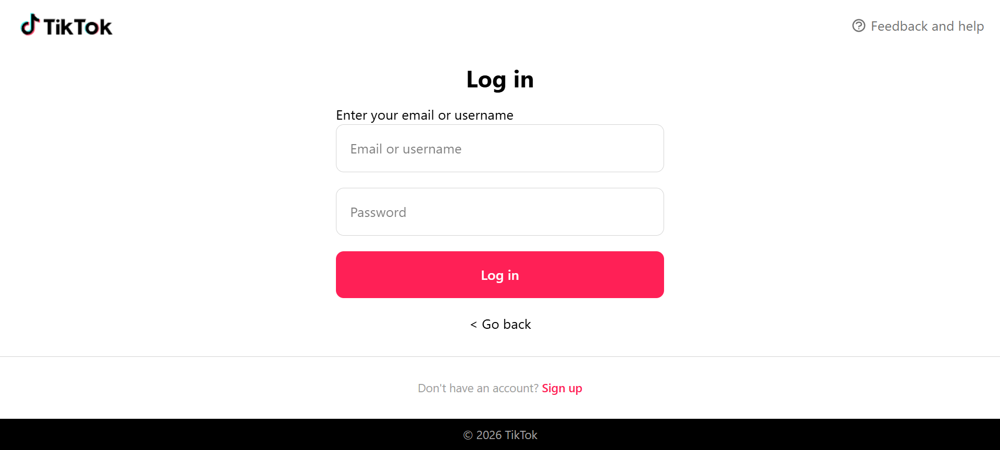
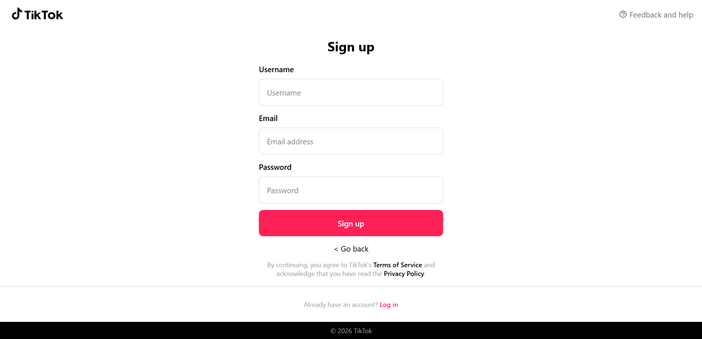
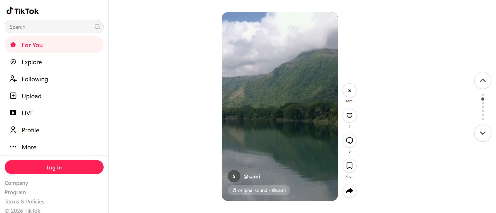
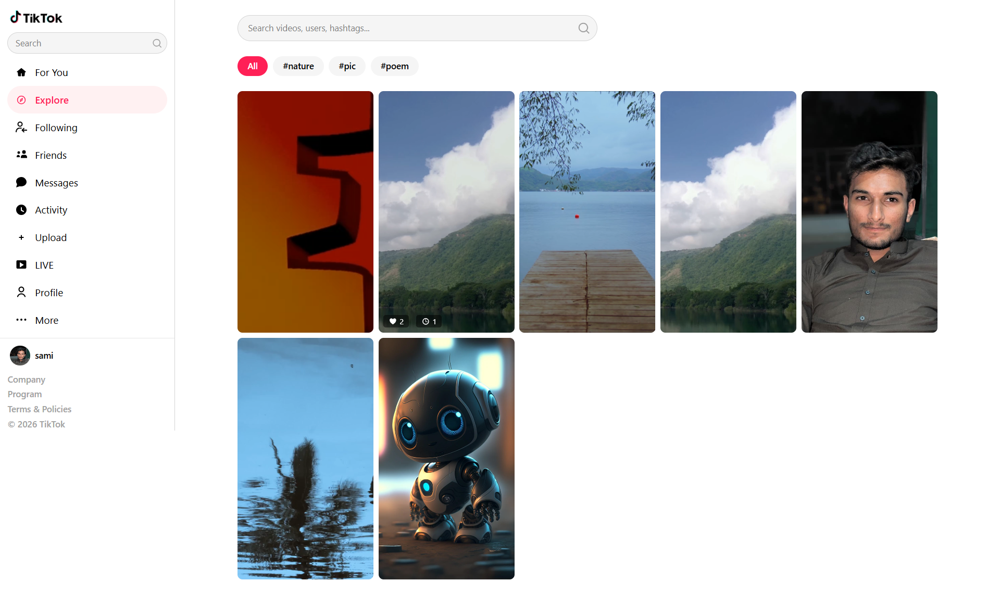
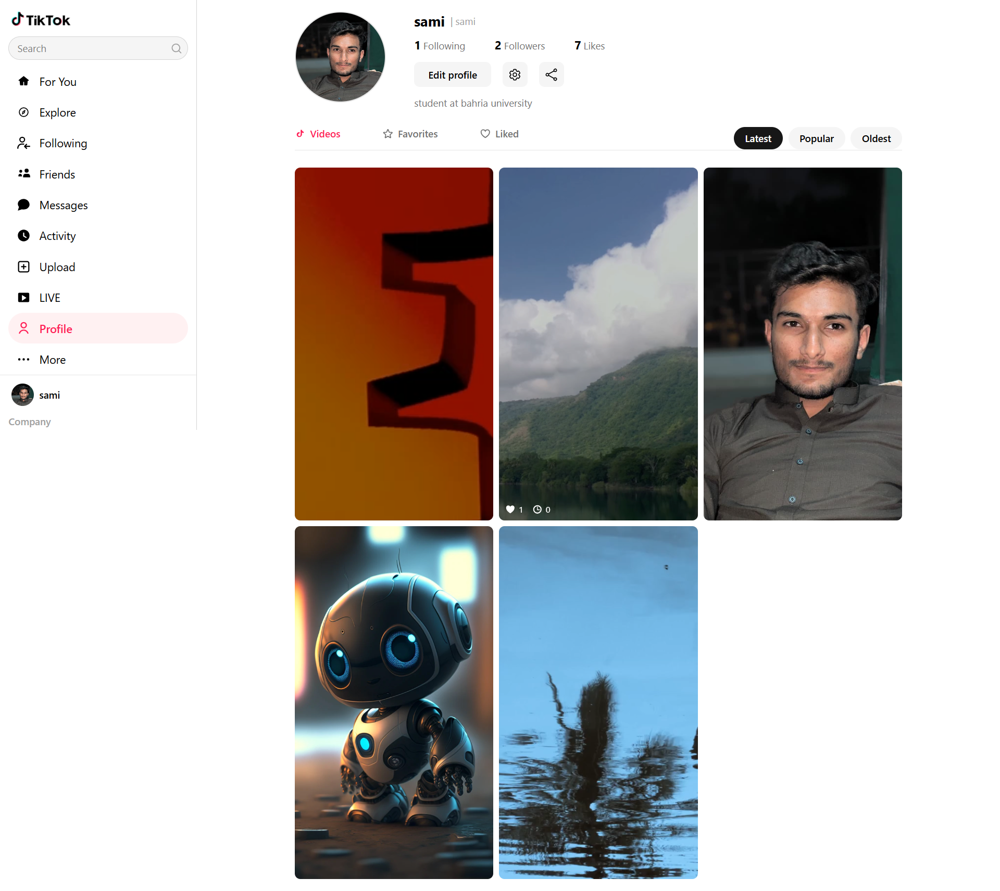
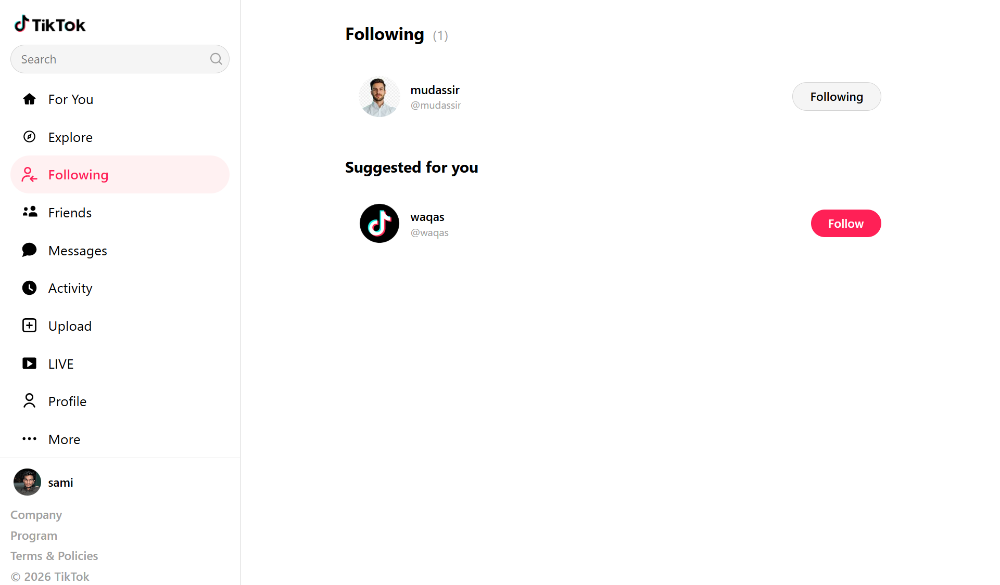
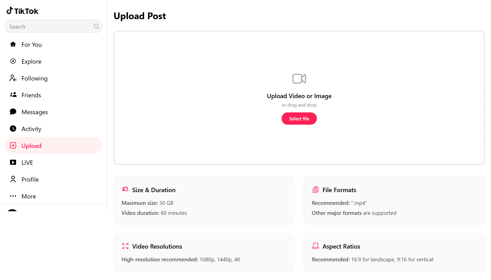

# TikTok Clone

A full-featured TikTok clone built with Django, featuring vertical video feed, user authentication with email verification, social interactions, and a responsive dark-mode UI.

## Tech Stack

| Frontend | Backend | Database |
|---|---|---|
| Tailwind CSS v4 | Django 6.0 / Python 3 | SQLite |
| Alpine.js | Django Templates (SSR) | |

## Features

- **TikTok-style video feed** — vertical scrolling with keyboard/wheel navigation
- **Authentication** — signup/login with email verification (6-digit code via SMTP)
- **User profiles** — avatar, bio, stats, edit modal, public profiles
- **Post creation** — upload videos/images with caption, hashtags, mentions, location, scheduling, privacy, soundtrack
- **Social interactions** — like, comment (nested replies), bookmark, share, follow/unfollow
- **Friends system** — mutual follows feed + suggested users
- **Activity feed** — notifications for likes, comments, mentions, follows
- **Conversations** — comment-based messaging between users
- **Explore page** — search videos/users/hashtags with live suggestions
- **Dark mode** — persisted toggle
- **Responsive sidebar** — collapsible navigation

## Pages & Screenshots

### Landing Page
Landing/splash page with login/signup promotion.


### Login
Login form with email/username and password.


### Signup
Registration with email verification (6-digit code with resend timer).


### Home Feed
Main TikTok-style vertical video feed with like/comment/bookmark/share actions, comments panel, activity panel, and sidebar navigation.


### Explore
Search page with trending hashtag filters, user results, video grid, and live suggestions dropdown.


### Profile
Own profile page with avatar, stats, edit modal, and tabs for Videos / Favorites / Liked posts.


### Public Profile
Other user's profile with follow button, stats, and post grid.


### Following
List of followed users and suggested accounts.


### Friends
Friends' posts grid with suggested users and their content.


### Post Detail
Single post view with full video, likes, comments with threaded replies, edit/delete modals, and likers panel.


### Upload
Post creation form with drag-and-drop, caption, hashtags, mentions, location, scheduling, privacy, and soundtrack selection.


## Installation

```bash
# Clone the repository
git clone https://github.com/yourusername/tiktok-clone.git
cd tiktok-clone

# Create and activate virtual environment
python -m venv venv
source venv/bin/activate  # Windows: venv\Scripts\activate

# Install Python dependencies
pip install -r requirements.txt

# Install Node dependencies (for Tailwind CSS)
npm install

# Build Tailwind CSS
npm run tw:build

# Run migrations
python manage.py migrate

# Create a superuser
python manage.py createsuperuser

# Start the development server
python manage.py runserver
```

## Usage

1. Visit `http://127.0.0.1:8000/` — you'll be greeted by the landing page
2. Sign up or log in to access the full app
3. Upload videos/images from the upload page
4. Scroll through the home feed, interact with posts, follow users, and explore content

## Configuration

Email verification requires SMTP settings in `tiktok/settings.py`. Configure your email backend:

```python
EMAIL_BACKEND = 'django.core.mail.backends.smtp.EmailBackend'
EMAIL_HOST = 'smtp.gmail.com'
EMAIL_PORT = 587
EMAIL_USE_TLS = True
EMAIL_HOST_USER = 'your-email@gmail.com'
EMAIL_HOST_PASSWORD = 'your-app-password'
```

## Management Commands

```bash
# Load soundtracks into the database
python manage.py load_soundtracks
```

## License

[MIT](LICENSE)
